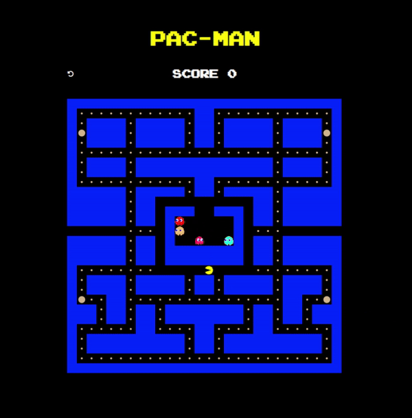

# Pac-Man Game

## Gameplay

This is a simple implementation of the classic Pac-Man game using JavaScript.

## Features

- Player controls Pac-Man using arrow keys.
- Pac-Man must eat all the dots while avoiding the ghosts.
- Power pellets can be eaten to temporarily turn the ghosts blue and vulnerable.
- Eating a vulnerable ghost will earn extra points.
- The game ends when Pac-Man is caught by a ghost or the score reaches 274.
